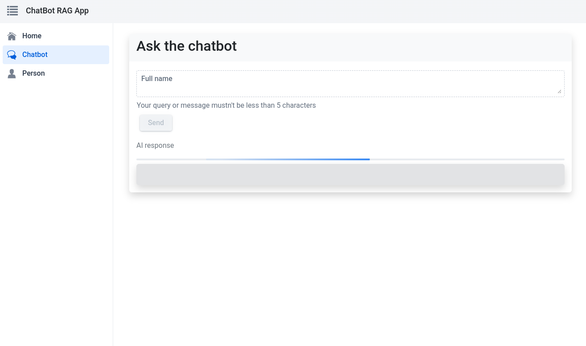
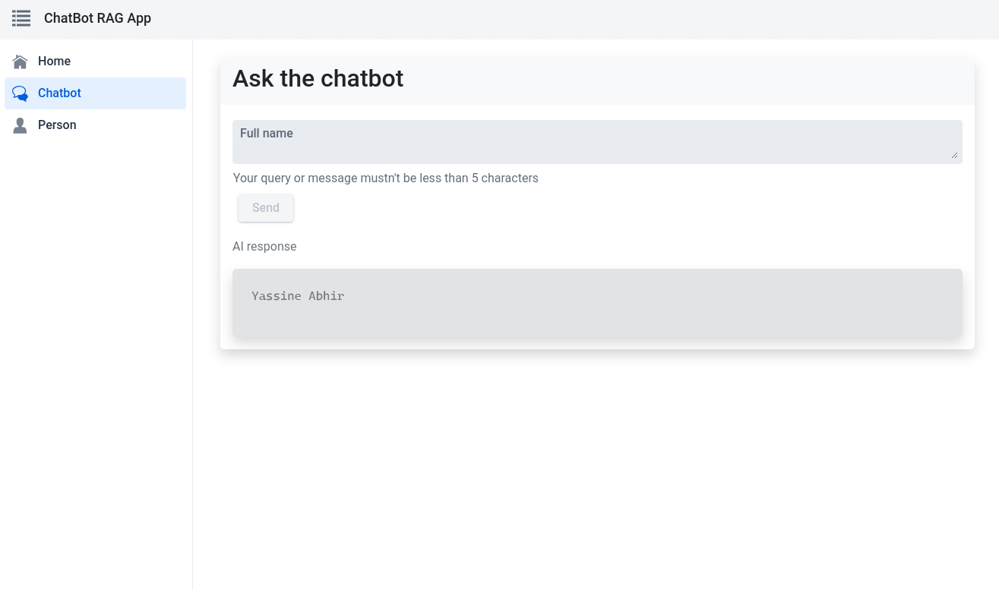
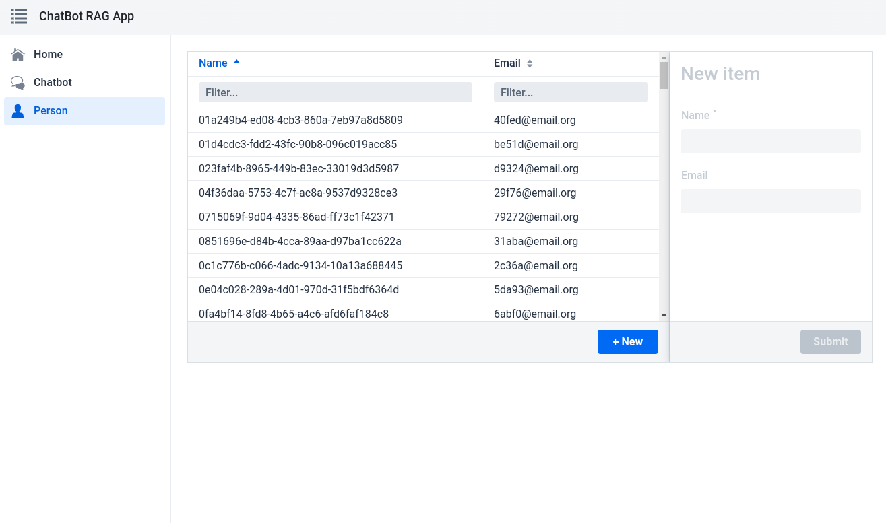

# 🚀 Projet Chatbot RAG d'OpenAI

Bienvenue dans le projet de Chatbot avec Génération Augmentée par Récupération (RAG) d'OpenAI ! Ce dépôt contient une application web full-stack construite avec Spring pour le backend, React pour le frontend, et des composants Vaadin pour l'interface utilisateur. La fonctionnalité principale de cette application est un chatbot qui utilise l'API OpenAI avec le modèle GPT-4 et un store vectoriel pour stocker et fournir le contexte.

## Captures d'écran





## 📂 Structure du projet

### 🖥️ Frontend

Le frontend de l'application comprend 3 pages et 1 layout, stylés avec des composants Vaadin et Bootstrap :

1. **🏠 Page d'accueil** :
   - **Chemin** : `/`
   - **Description** : Page d'accueil de l'application Chatbot RAG d'OpenAI.

2. **💬 Page Chatbot** :
   - **Chemin** : `/chatbot`
   - **Description** : Page permettant à l'utilisateur de poser des questions au chatbot, qui utilise des données stockées dans un store vectoriel Postgres pour fournir des réponses.

3. **👤 Page Personne** :
   - **Chemin** : `/person`
   - **Description** : Implémente l'AutoCRUD en utilisant les données de la base de données.

4. **🔧 Layout** :
   - **Contient** : Une barre supérieure et une barre latérale pour la navigation.

### 🛠️ Backend

Le backend est construit avec Spring Boot et inclut les composants suivants :

1. **💡 ChatBotAiService** :
   - **Package** : `ma.yassine.finalexamrag.services`
   - **Annotations** : `@BrowserCallable`, `@AnonymousAllowed`
   - **Description** : Ce service gère les fonctionnalités du chatbot, y compris l'initialisation du client de chat et du store vectoriel, et le traitement des questions pour générer des réponses en utilisant RAG.

2. **📄 RagDataLoader** :
   - **Package** : `ma.yassine.finalexamrag.config`
   - **Annotations** : `@Component`
   - **Description** : Ce composant initialise le store vectoriel s'il n'existe pas. Il lit les données à partir d'un fichier PDF, les divise en morceaux et les stocke dans le store vectoriel.

3. **📋 Entité Person et CrudRepositoryService** :
   - **Description** : L'entité `Person` est gérée en utilisant les fonctionnalités de dépôt CRUD de Spring Data pour les opérations sur la base de données.

### 🔑 Dépendances clés

- **Spring Boot** : Framework backend.
- **React** : Framework frontend.
- **Vaadin** : Composants UI.
- **Bootstrap** : Stylisation.
- **API OpenAI** : Pour les fonctionnalités du chatbot.
- **Postgres** : Base de données avec capacité de store vectoriel.
- **Docker Compose** : Pour gérer le conteneur Postgres.

## 🚀 Démarrage

### 🛠️ Prérequis

- JDK 11 ou plus
- Node.js et npm
- Docker et Docker Compose

### ⚙️ Configuration du Backend

1. Clonez le dépôt et naviguez dans le répertoire backend :

    ```sh
    git clone https://github.com/yassine/FINAL-PROJECT-RAG
    cd FINAL-PROJECT-RAG
    ```

2. Configurez le conteneur Postgres en utilisant Docker Compose :

    ```sh
    docker-compose up -d
    ```

3. Installez les dépendances et lancez l'application :

    ```sh
    ./mvnw spring-boot:run
    ```

### ⚙️ Configuration du Frontend

- Installez les dépendances et démarrez le serveur de développement :

    ```sh
    npm install
    npm start
    ```

### 📦 Docker Compose

Le dépôt inclut un fichier Docker Compose pour configurer un conteneur Postgres. Assurez-vous que Docker et Docker Compose sont installés sur votre machine.

- Démarrez le conteneur Postgres :

    ```sh
    docker-compose up -d
    ```

## 🎉 Utilisation

- Ouvrez votre navigateur et naviguez vers `http://localhost:9095`.
- Vous verrez la page d'accueil vous accueillant dans l'application Chatbot RAG d'OpenAI.
- Utilisez la barre latérale pour naviguer vers la page du chatbot et interagir avec celui-ci.
- Naviguez vers la page des personnes pour effectuer des opérations CRUD sur l'entité `Person`.
